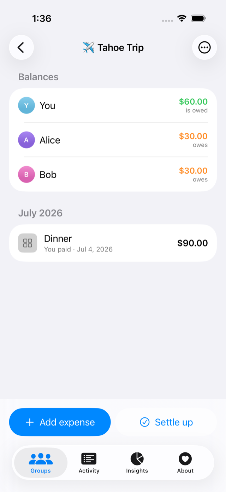
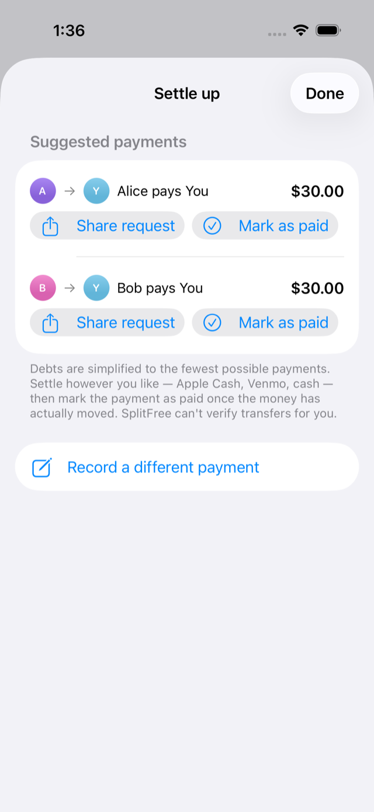
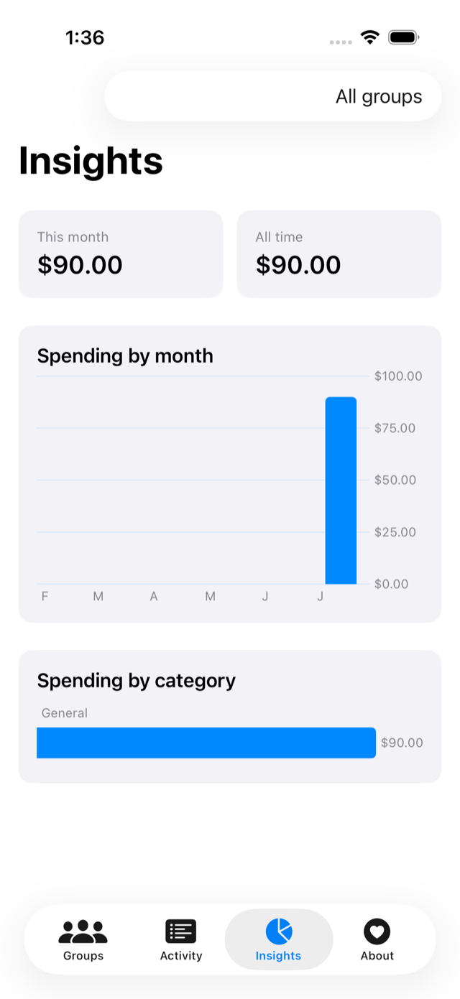

# SplitFree

A completely free iOS Splitwise alternative. Every feature Splitwise puts behind
its Pro subscription is free here — no ads, no accounts, no servers.

<p>



</p>

## Features

**Core (what Splitwise gives free):** groups, expenses, equal/exact/percentage/shares
splits, running balances, debt simplification (min-cash-flow: the fewest possible
payments), recorded settlements, recurring expenses.

**The paywalled stuff, free:**

| Splitwise Pro feature | SplitFree implementation |
|---|---|
| Receipt scanning | On-device Vision OCR reads the line items into the itemized-split editor; photo never leaves the phone |
| Currency conversion | 30 currencies with bundled offline rates |
| Itemization | Per-line-item splits; tax/tip spread proportionally |
| Expense search | Full search across all groups (Activity tab) |
| Charts | Swift Charts monthly + category breakdowns (Insights tab) |
| Ad-free | There are no ads to remove |

## Architecture decisions

**Why no in-app Apple Pay button.** Apple exposes no public API for sending —
or confirming — person-to-person Apple Cash payments. PassKit is for paying
*merchants* and requires a payment processor. Since SplitFree can't verify that
money actually moved, it deliberately stays out of the payment itself: settle
with whatever tool you like (a share button hands the request text to Messages,
Venmo, mail, anything), and a payment only enters the ledger when you
explicitly **mark it as paid**.

**Why no database server.** Storage is SwiftData mirrored to **CloudKit** —
Apple's free hosted storage, the "Game Center for data." Data syncs through the
user's private iCloud database when they're signed in, and falls back to a
device-local store otherwise (also forced in UI tests via `--local-store`). The
models follow CloudKit's compatibility rules: no unique constraints, defaults
everywhere, and an inverse on every relationship. Shared groups between users
(`CKShare`) are the next step on the same infrastructure. No third-party
servers, ever.

**Money math.** All amounts are integer minor units (cents). Splits use
largest-remainder allocation so every penny is accounted for deterministically.
Debt simplification is greedy min-cash-flow (largest debtor ↔ largest creditor),
guaranteeing ≤ n−1 transfers.

## Project layout

- `SplitCore/` — pure Swift package: `Money`, `SplitCalculator`, `DebtSimplifier`,
  `Ledger`, `CurrencyConverter`. Unit-tested (`swift test`, 17 tests).
- `App/` — SwiftUI app: SwiftData models + views (groups, expense form with all
  split modes and itemization, settle up, activity search, insights charts,
  receipt scanner).
- `UITests/` — XCUITest end-to-end flow (create group → split → settle → persist
  across relaunch) plus a screenshot tour.

## Building

```sh
brew install xcodegen   # once
xcodegen generate
xcodebuild -project SplitFree.xcodeproj -scheme SplitFree \
  -destination 'platform=iOS Simulator,name=iPhone 17 Pro' build
```

Unit tests: `cd SplitCore && swift test`. UI tests: `xcodebuild test` with the
same scheme.

## Roadmap

- `CKShare` shared groups so friends see the same live ledger (private-database
  sync is already in)
- Live exchange rates (optional network fetch, still no server)
- Expense detail view with per-person breakdown
- Widgets / App Intents ("Add expense" from the Home Screen)
